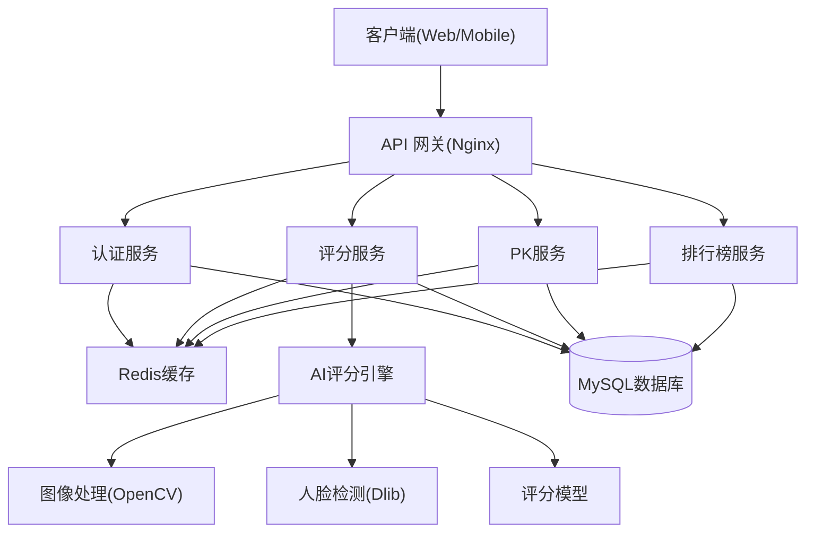
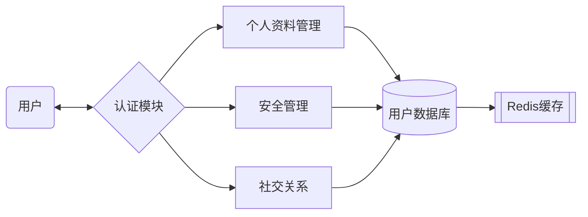
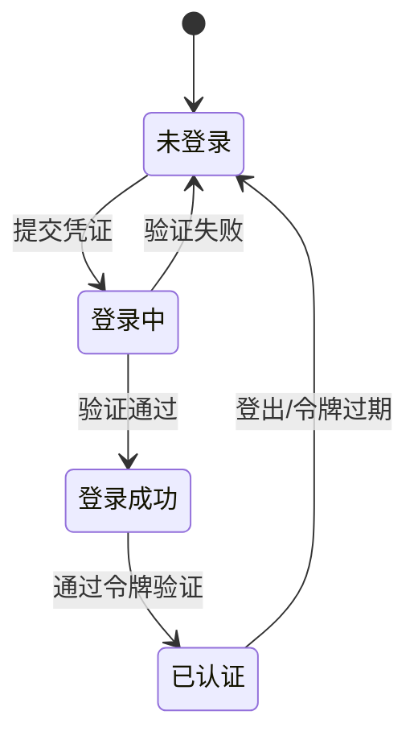
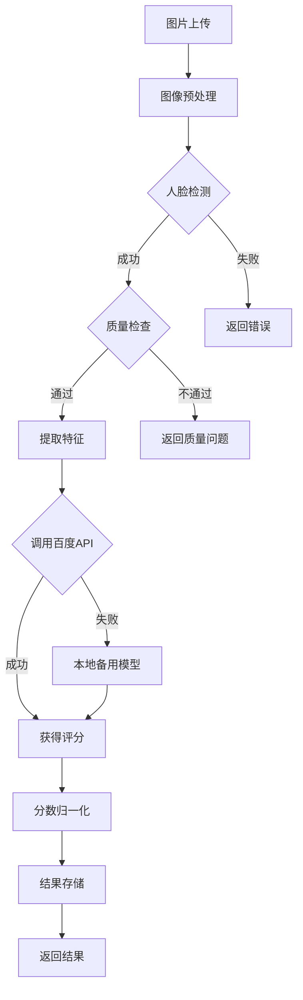
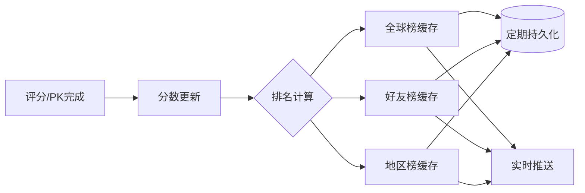
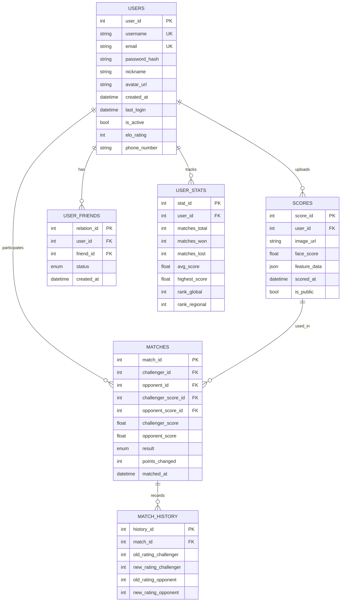
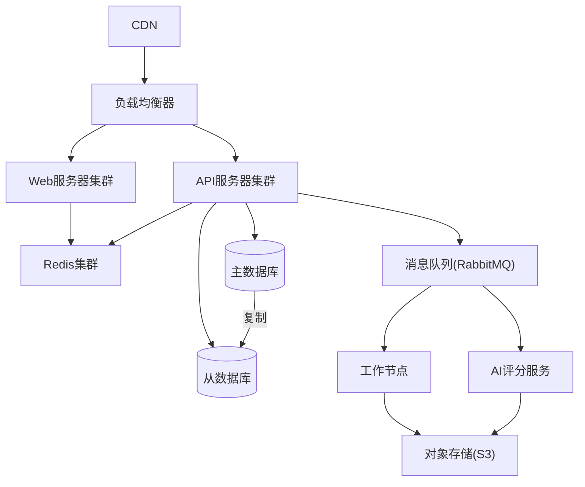

# **魔镜 Mirror 颜值 PK 平台项目详细设计文档**
**Version 2.0**

## **1. 项目概述**

### **1.1 项目背景与目标**
"魔镜 Mirror 颜值 PK 平台"是基于人脸识别技术的娱乐社交 Web 应用，通过 AI 技术评估用户面容的美学分值，支持照片评分、用户对战及社交分享功能。

**业务目标：**
- 用户活跃度：每日活跃用户 5000+，月活 10 万+
- 留存率：次日留存 40%，7 日留存 25%
- 分享率：20% 的 PK 结果被分享到社交平台

**技术目标：**
- 评分准确度：基于 SCUT-FBP5500 数据集训练，评分准确率 90%+
- 系统性能：峰值支持 1000QPS，评分响应时间 < 1.5秒
- 可用性：99.9% 系统可用性，7×24 稳定运行

### **1.2 需求概述**
1. **功能需求**
   - 用户账户管理（注册、登录、信息修改）
   - 照片上传与颜值评分（AI 打分 0-100）
   - 用户间 PK 对战（积分变化、排名更新）
   - 排行榜系统（全球榜、好友榜）
   - 社交分享（生成分享卡片）

2. **非功能需求**
   - 安全性：用户照片加密存储，防止未授权访问
   - 性能：评分系统响应时间不超过 1.5 秒
   - 扩展性：模块化设计，支持未来功能拓展
   - 兼容性：Web/iOS/Android 多平台支持

## **2. 系统架构设计**

### **2.1 总体架构**
采用前后端分离的微服务架构，主要分为以下层次：

```
客户端层 → API 网关层 → 服务层 → 数据持久层 → 基础设施层
```

**架构图：**


### **2.2 技术架构**

#### **2.2.1 前端技术架构**
- **核心框架**：React 18 + TypeScript 5.0
- **状态管理**：Redux Toolkit + React Query
- **UI组件库**：Ant Design 5.0 + TailwindCSS 3.0
- **构建工具**：Vite 4.0
- **测试框架**：Jest + React Testing Library

**前端代码架构：**
```
/src
  /api          # API 请求封装
  /assets       # 静态资源
  /components   # 共享组件
    /common     # 通用组件
    /features   # 功能组件
  /hooks        # 自定义 hooks
  /pages        # 页面组件
  /redux        # Redux 状态管理
  /services     # 服务层
  /styles       # 全局样式
  /types        # TypeScript 类型定义
  /utils        # 工具函数
```

#### **2.2.2 后端技术架构**
- **API 层**：FastAPI 0.100.0（主 API 服务）
- **评分服务**：Flask 2.3 + OpenCV 4.8 + Dlib 19.24
- **鉴权服务**：Python JWT（无状态认证）
- **队列处理**：Celery 5.3 + Redis Queue（异步任务）
- **ORM**：SQLAlchemy 2.0（数据库交互）

**后端代码架构：**
```
/backend
  /api          # API 定义
    /v1         # V1 接口
  /core         # 核心配置
  /db           # 数据库模型和管理
  /dependencies # 依赖注入
  /models       # 数据模型
  /schemas      # 验证模式
  /services     # 业务逻辑服务
    /auth       # 认证服务
    /scoring    # 评分服务
    /pk         # PK 对战服务
    /ranking    # 排行榜服务
  /utils        # 工具函数
  main.py       # 应用入口
```

#### **2.2.3 AI 评分引擎架构**
- **主方案**：百度 AI 人脸评分 API
- **备用方案**：自研 CNN 模型（基于 SCUT-FBP5500 数据集）
- **模型框架**：PyTorch 2.0 + ONNX Runtime
- **特征提取**：Face Landmarks（68 点）+ 面部几何特征

## **3. 详细模块设计**

### **3.1 用户中心子系统**

#### **3.1.1 功能模块**
1. **账户管理**
   - 用户注册（邮箱/手机号）
   - 用户登录（多端同步）
   - 密码重置
   - 账号注销

2. **个人资料管理**
   - 基本信息（昵称、签名）
   - 头像上传与编辑
   - 隐私设置

3. **安全管理**
   - 密码修改
   - 登录历史
   - 设备管理

4. **社交关系**
   - 好友添加与管理
   - 关注/粉丝系统
   - 好友动态

#### **3.1.2 数据流图**


#### **3.1.3 状态转换**
用户登录状态转换：


### **3.2 颜值评分子系统**

#### **3.2.1 功能模块**
1. **图像处理**
   - 图像上传（支持主流格式）
   - 图像优化（光线调整、角度校正）
   - 人脸检测与裁剪
   - 质量评估（判断是否满足评分条件）

2. **评分引擎**
   - 特征提取（面部关键点、几何特征）
   - 美学评分（基于训练模型）
   - 分数归一化（0-100 分制）
   - 特征分析（五官优劣评价）

3. **结果处理**
   - 评分结果存储
   - 历史记录对比
   - 数据统计与分析

#### **3.2.2 评分流程**


### **3.3 颜值 PK 对战子系统**

#### **3.3.1 功能模块**
1. **对战匹配**
   - 好友挑战
   - 随机匹配
   - 历史对手重赛

2. **ELO 积分系统**
   - 积分计算算法
   - 段位划分（青铜/白银/黄金/...）
   - 积分历史追踪

3. **对战结果处理**
   - 结果通知
   - 积分变更
   - 排名更新
   - 战绩记录

#### **3.3.2 积分计算公式**
使用 ELO 算法计算积分变化：

```
Ea = 1 / (1 + 10^((Rb - Ra) / 400))
Eb = 1 / (1 + 10^((Ra - Rb) / 400))

Ra_new = Ra + K * (Sa - Ea)
Rb_new = Rb + K * (Sb - Eb)

其中：
Ra, Rb: 两位玩家当前积分
Ea, Eb: 两位玩家的预期得分
Sa, Sb: 实际比赛结果 (胜=1, 平=0.5, 负=0)
K: 积分变化系数 (K=32)
```

### **3.4 排行榜与分享子系统**

#### **3.4.1 功能模块**
1. **排行榜**
   - 全球颜值榜
   - 好友排行榜
   - 地区排行榜
   - 周/月榜单

2. **数据统计**
   - 个人数据分析
   - 群体数据趋势
   - 排名变化历史

3. **社交分享**
   - 分享卡片生成
   - 社交平台集成
   - 邀请好友

#### **3.4.2 排行榜更新机制**


## **4. 数据库设计**

### **4.1 ER 图**


### **4.2 详细表结构**

#### **4.2.1 users 表**
| 字段名 | 类型 | 约束 | 描述 |
|--------|------|------|------|
| user_id | INT | PK, AUTO_INCREMENT | 用户唯一标识 |
| username | VARCHAR(50) | UNIQUE, NOT NULL | 用户名 |
| email | VARCHAR(100) | UNIQUE, NOT NULL | 邮箱 |
| password_hash | VARCHAR(255) | NOT NULL | 密码哈希 |
| nickname | VARCHAR(50) | | 昵称 |
| avatar_url | VARCHAR(255) | | 头像URL |
| bio | TEXT | | 个人简介 |
| phone_number | VARCHAR(20) | | 手机号 |
| elo_rating | INT | DEFAULT 1500 | ELO积分 |
| created_at | DATETIME | DEFAULT CURRENT_TIMESTAMP | 注册时间 |
| last_login | DATETIME | | 最后登录时间 |
| is_active | BOOLEAN | DEFAULT TRUE | 账户状态 |
| region_code | VARCHAR(5) | | 地区代码 |

#### **4.2.2 scores 表**
| 字段名 | 类型 | 约束 | 描述 |
|--------|------|------|------|
| score_id | INT | PK, AUTO_INCREMENT | 评分记录ID |
| user_id | INT | FK(users.user_id) | 关联用户 |
| image_url | VARCHAR(255) | NOT NULL | 图片URL |
| image_hash | VARCHAR(64) | | 图片哈希值 |
| face_score | FLOAT | CHECK(0<=face_score<=100) | 颜值分数 |
| feature_data | JSON | | 特征数据 |
| scored_at | DATETIME | DEFAULT CURRENT_TIMESTAMP | 评分时间 |
| is_public | BOOLEAN | DEFAULT TRUE | 是否公开 |
| service_type | ENUM('baidu', 'local') | DEFAULT 'baidu' | 评分服务类型 |

#### **4.2.3 matches 表**
| 字段名 | 类型 | 约束 | 描述 |
|--------|------|------|------|
| match_id | INT | PK, AUTO_INCREMENT | 对战ID |
| challenger_id | INT | FK(users.user_id) | 发起者ID |
| opponent_id | INT | FK(users.user_id) | 对手ID |
| challenger_score_id | INT | FK(scores.score_id) | 发起者评分ID |
| opponent_score_id | INT | FK(scores.score_id) | 对手评分ID |
| challenger_score | FLOAT | NOT NULL | 发起者分数 |
| opponent_score | FLOAT | NOT NULL | 对手分数 |
| result | ENUM('Win','Lose','Tie') | NOT NULL | 结果 |
| points_changed | INT | NOT NULL | 积分变化 |
| matched_at | DATETIME | DEFAULT CURRENT_TIMESTAMP | 对战时间 |

#### **4.2.4 user_friends 表**
| 字段名 | 类型 | 约束 | 描述 |
|--------|------|------|------|
| relation_id | INT | PK, AUTO_INCREMENT | 关系ID |
| user_id | INT | FK(users.user_id) | 用户ID |
| friend_id | INT | FK(users.user_id) | 好友ID |
| status | ENUM('pending','accepted','blocked') | DEFAULT 'pending' | 关系状态 |
| created_at | DATETIME | DEFAULT CURRENT_TIMESTAMP | 创建时间 |

#### **4.2.5 user_stats 表**
| 字段名 | 类型 | 约束 | 描述 |
|--------|------|------|------|
| stat_id | INT | PK, AUTO_INCREMENT | 统计ID |
| user_id | INT | FK(users.user_id), UNIQUE | 用户ID |
| matches_total | INT | DEFAULT 0 | 总对战次数 |
| matches_won | INT | DEFAULT 0 | 获胜次数 |
| matches_lost | INT | DEFAULT 0 | 失败次数 |
| avg_score | FLOAT | DEFAULT 0 | 平均分数 |
| highest_score | FLOAT | DEFAULT 0 | 最高分数 |
| rank_global | INT | | 全球排名 |
| rank_regional | INT | | 地区排名 |
| last_updated | DATETIME | DEFAULT CURRENT_TIMESTAMP | 最后更新时间 |

## **5. 接口设计**

### **5.1 API 规范**
- **基础路径**：`https://api.mirror-pk.com/v1`
- **认证方式**：JWT Bearer Token
- **内容格式**：JSON
- **状态码**：遵循 HTTP 标准状态码
- **版本控制**：URL 路径中包含版本号（/v1/）

### **5.2 用户认证 API**

#### **注册用户**
```
POST /auth/register
```

**请求体**：
```json
{
  "username": "user1234",
  "email": "user@example.com",
  "password": "SecurePass123!",
  "nickname": "Mirror User"
}
```

**响应 (201 Created)**：
```json
{
  "user_id": 10001,
  "username": "user1234",
  "token": "eyJhbGciOiJIUzI1NiIsInR5cCI6IkpXVCJ9...",
  "expires_at": "2025-07-15T12:00:00Z"
}
```

#### **用户登录**
```
POST /auth/login
```

**请求体**：
```json
{
  "username": "user1234",
  "password": "SecurePass123!"
}
```

**响应 (200 OK)**：
```json
{
  "user_id": 10001,
  "username": "user1234",
  "nickname": "Mirror User",
  "avatar_url": "https://cdn.mirror-pk.com/avatars/10001.jpg",
  "token": "eyJhbGciOiJIUzI1NiIsInR5cCI6IkpXVCJ9...",
  "expires_at": "2025-07-15T12:00:00Z"
}
```

#### **刷新令牌**
```
POST /auth/refresh
```

**请求头**：
```
Authorization: Bearer {refresh_token}
```

**响应 (200 OK)**：
```json
{
  "token": "eyJhbGciOiJIUzI1NiIsInR5cCI6IkpXVCJ9...",
  "expires_at": "2025-07-15T14:00:00Z"
}
```

### **5.3 颜值评分 API**

#### **上传并评分**
```
POST /scores
```

**请求头**：
```
Authorization: Bearer {token}
Content-Type: multipart/form-data
```

**请求体**：
```
image: [binary data]
is_public: true
```

**响应 (201 Created)**：
```json
{
  "score_id": 5001,
  "face_score": 85.7,
  "image_url": "https://cdn.mirror-pk.com/scores/5001.jpg",
  "feature_highlights": {
    "eyes": 9.1,
    "nose": 8.5,
    "lips": 8.9,
    "face_shape": 8.6,
    "symmetry": 9.2
  },
  "percentile": 92,
  "created_at": "2025-07-12T08:45:23Z"
}
```

#### **获取历史评分**
```
GET /scores/user/{user_id}
```

**请求参数**：
```
page: 1
limit: 10
sort: "scored_at:desc"
```

**响应 (200 OK)**：
```json
{
  "total": 24,
  "page": 1,
  "limit": 10,
  "data": [
    {
      "score_id": 5001,
      "face_score": 85.7,
      "image_url": "https://cdn.mirror-pk.com/scores/5001.jpg",
      "scored_at": "2025-07-12T08:45:23Z"
    },
    // ... 更多记录
  ]
}
```

### **5.4 PK 对战 API**

#### **发起 PK 对战**
```
POST /matches
```

**请求头**：
```
Authorization: Bearer {token}
```

**请求体**：
```json
{
  "opponent_id": 10002,
  "score_id": 5001
}
```

**响应 (201 Created)**：
```json
{
  "match_id": 3001,
  "challenger": {
    "user_id": 10001,
    "username": "user1234",
    "score": 85.7,
    "image_url": "https://cdn.mirror-pk.com/scores/5001.jpg"
  },
  "opponent": {
    "user_id": 10002,
    "username": "opponent",
    "score": 82.3,
    "image_url": "https://cdn.mirror-pk.com/scores/4852.jpg"
  },
  "result": "Win",
  "points_change": 18,
  "new_rating": 1518,
  "matched_at": "2025-07-12T09:15:10Z"
}
```

#### **获取对战历史**
```
GET /matches/user/{user_id}
```

**请求参数**：
```
page: 1
limit: 10
result: "Win" (可选)
```

**响应 (200 OK)**：
```json
{
  "total": 42,
  "page": 1,
  "limit": 10,
  "data": [
    {
      "match_id": 3001,
      "opponent": {
        "user_id": 10002,
        "username": "opponent"
      },
      "challenger_score": 85.7,
      "opponent_score": 82.3,
      "result": "Win",
      "points_change": 18,
      "matched_at": "2025-07-12T09:15:10Z"
    },
    // ... 更多记录
  ]
}
```

### **5.5 排行榜 API**

#### **获取全球排行榜**
```
GET /rankings/global
```

**请求参数**：
```
page: 1
limit: 10
period: "all" (可选: "day", "week", "month")
```

**响应 (200 OK)**：
```json
{
  "total": 25000,
  "page": 1,
  "limit": 10,
  "data": [
    {
      "rank": 1,
      "user_id": 12503,
      "username": "beauty_queen",
      "nickname": "Mirror Queen",
      "avatar_url": "https://cdn.mirror-pk.com/avatars/12503.jpg",
      "highest_score": 98.2,
      "avg_score": 95.7,
      "elo_rating": 2145
    },
    // ... 更多记录
  ]
}
```

#### **获取好友排行榜**
```
GET /rankings/friends
```

**请求头**：
```
Authorization: Bearer {token}
```

**响应 (200 OK)**：
```json
{
  "total": 28,
  "data": [
    {
      "rank": 1,
      "user_id": 10056,
      "username": "friend1",
      "nickname": "Best Friend",
      "avatar_url": "https://cdn.mirror-pk.com/avatars/10056.jpg",
      "highest_score": 91.5,
      "elo_rating": 1876
    },
    // ... 更多记录
  ]
}
```

## **6. 组件设计**

### **6.1 前端组件**

#### **6.1.1 公共组件**
1. **`Header`组件**
   - 导航菜单
   - 用户菜单下拉
   - 通知组件集成

2. **`ImageUploader`组件**
   - 拖拽上传
   - 图片预览&裁剪
   - 上传进度条

3. **`ScoreCard`组件**
   - 颜值分数展示
   - 特征雷达图
   - 分享按钮

4. **`RankList`组件**
   - 排行榜条目渲染
   - 分页控制
   - 排名变化动画

#### **6.1.2 页面组件**
1. **`Profile`页面**
   - 个人信息展示
   - 历史照片管理
   - 战绩统计

2. **`ScoringPage`页面**
   - 照片上传区域
   - 评分结果展示
   - PK发起按钮

3. **`BattlePage`页面**
   - 对手选择
   - 对战结果展示
   - 积分变化动画

4. **`RankingPage`页面**
   - 选项卡（全球/地区/好友）
   - 排行榜列表
   - 搜索筛选

### **6.2 后端组件**

#### **6.2.1 核心服务**
1. **`AuthService`**
```python
class AuthService:
    async def register_user(self, user_data: UserCreate) -> Dict:
        """注册新用户并返回令牌"""
        
    async def login_user(self, credentials: UserLogin) -> Dict:
        """验证用户并返回令牌"""
        
    async def refresh_token(self, refresh_token: str) -> Dict:
        """刷新访问令牌"""
        
    async def validate_token(self, token: str) -> UserModel:
        """验证令牌并返回用户模型"""
```

2. **`ScoringService`**
```python
class ScoringService:
    async def upload_and_score(self, user_id: int, image_data: bytes, is_public: bool) -> Dict:
        """上传图片并进行颜值评分"""
        
    async def get_user_scores(self, user_id: int, page: int, limit: int) -> Dict:
        """获取用户历史评分记录"""
        
    async def detect_face(self, image_data: bytes) -> Dict:
        """检测人脸并返回特征点"""
        
    async def calculate_score(self, face_features: Dict) -> float:
        """基于特征计算颜值分数"""
```

3. **`MatchService`**
```python
class MatchService:
    async def create_match(self, user_id: int, opponent_id: int, score_id: int) -> Dict:
        """创建新的PK对战"""
        
    async def get_user_matches(self, user_id: int, page: int, limit: int) -> Dict:
        """获取用户对战历史"""
        
    async def calculate_elo(self, user_rating: int, opponent_rating: int, result: str) -> Tuple[int, int]:
        """计算ELO积分变化"""
```

4. **`RankingService`**
```python
class RankingService:
    async def get_global_ranking(self, page: int, limit: int, period: str) -> Dict:
        """获取全球排行榜"""
        
    async def get_friend_ranking(self, user_id: int) -> Dict:
        """获取好友排行榜"""
        
    async def update_user_rank(self, user_id: int) -> None:
        """更新用户排名"""
```

#### **6.2.2 AI 评分引擎**
```python
class FaceScoringEngine:
    def __init__(self, use_baidu_api: bool = True):
        """初始化评分引擎"""
        self.use_baidu_api = use_baidu_api
        self.face_detector = dlib.get_frontal_face_detector()
        self.landmark_predictor = dlib.shape_predictor("models/shape_predictor_68_face_landmarks.dat")
        self.local_model = torch.load("models/face_scoring_model.pt")
        
    def preprocess_image(self, image: np.ndarray) -> np.ndarray:
        """图像预处理"""
        
    def detect_face(self, image: np.ndarray) -> Tuple[bool, Optional[Dict]]:
        """人脸检测"""
        
    def extract_features(self, image: np.ndarray, face_rect) -> Dict:
        """提取面部特征"""
        
    async def score_face(self, image: np.ndarray) -> Dict:
        """评分人脸"""
        if self.use_baidu_api:
            try:
                score_result = await self._call_baidu_api(image)
                return score_result
            except Exception as e:
                # API调用失败，回退到本地模型
                return self._score_with_local_model(image)
        else:
            return self._score_with_local_model(image)
            
    async def _call_baidu_api(self, image: np.ndarray) -> Dict:
        """调用百度AI API进行评分"""
        
    def _score_with_local_model(self, image: np.ndarray) -> Dict:
        """使用本地模型进行评分"""
```

## **7. 安全设计**

### **7.1 认证与授权**
1. **JWT令牌**
   - 有效期设置：Access Token 2小时，Refresh Token 14天
   - 令牌吊销机制：Redis黑名单
   - 签名算法：HS256

2. **密码安全**
   - Bcrypt 哈希算法（工作因子12）
   - 密码复杂度要求：8字符+，包含大小写字母、数字、特殊字符

3. **接口授权**
   - RBAC (基于角色的访问控制)
   - API请求速率限制：IP级别 100次/分钟，用户级别 50次/分钟

### **7.2 数据安全**
1. **数据存储**
   - 用户照片加密存储
   - 敏感数据库字段加密
   - 备份策略：每日增量备份，每周全量备份

2. **网络安全**
   - HTTPS/TLS 1.3 加密传输
   - API网关防护：WAF配置
   - CDN内容分发：图片资源隔离

3. **防止攻击**
   - SQL注入防护：参数化查询+ORM
   - XSS防护：输入过滤+CSP
   - CSRF防护：令牌验证

## **8. 部署架构**

### **8.1 开发环境**
- 本地开发：Docker Compose
- 测试环境：Azure测试集群（2VM）
- 持续集成：GitHub Actions

### **8.2 生产环境**


- **Web层**：Nginx + React静态资源
- **API层**：多实例FastAPI服务
- **存储层**：主从复制MySQL + Redis集群
- **计算层**：Celery工作节点 + AI专用GPU节点
- **CDN层**：CloudFlare全球加速

### **8.3 扩展策略**
- **水平扩展**：API服务器和工作节点自动扩缩容
- **垂直扩展**：数据库读写分离、分片
- **地理分布**：多区域部署，就近访问

## **9. 测试策略**

### **9.1 测试类型**
1. **单元测试**
   - 覆盖率目标：后端代码 80%+，前端组件 70%+
   - 工具：PyTest、Jest/React Testing Library

2. **集成测试**
   - API端点测试
   - 数据流测试
   - 工具：Postman、TestContainers

3. **UI/UX测试**
   - 组件渲染测试
   - 用户流程测试
   - 跨浏览器兼容性测试

4. **性能测试**
   - 负载测试：模拟1000并发用户
   - 压力测试：极限并发和数据量
   - 工具：JMeter、k6

5. **安全测试**
   - 渗透测试
   - 静态代码分析
   - 第三方依赖漏洞扫描

### **9.2 测试流程**
```mermaid
flowchart LR
    Dev[开发] --> UnitTest[单元测试]
    UnitTest --> CodeReview[代码审查]